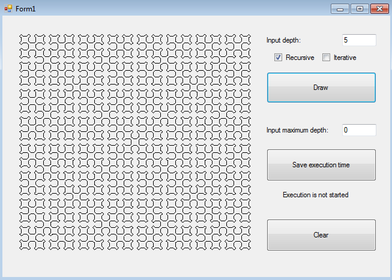
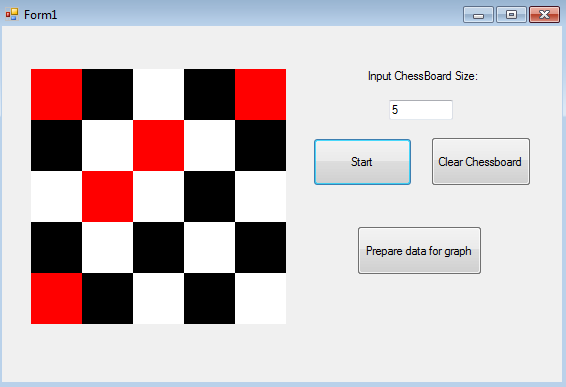

# Ivanov

# Project Title

This project contain the implementation of tasks on a special course "Design and Analysis of programming algorithms" (Physical department of MSU, 2016 year).

## Getting Started

This project includes several tasks, each of these tasks is a separate project written on C# programming language.

### 1. Levenshtein distance calculation.

Main information about Levenshtein distance calculation you can find here: [Wiki Link] (https://en.wikipedia.org/wiki/Levenshtein_distance). 

There are two different types of input data:
- As an input, one could send txt file with text, and programm will get two different random number of words, create a sentence and calculate Levenshtein distance for this two sentance. 
- In another input, programm will generate two different random strings and calculate Levenshtein distance for this two strings.

This operation will repeat and length of sentence or string, depending on choosen input will grow, and in output one will achive txt file with two columns: x - length of sentence (or string), y - appropriate Levenshtein distance. After that one could plot this dependancy, using plot.py script.

Result will be like on the picture below.


### 2. Сomparison of Bubble Sort and Selection Sort.

Main information about Bubble Sort one can find by click on next link: [Bubble Sort Link] (https://en.wikipedia.org/wiki/Bubble_sort) and information about Selection Sort here: [Selection Sort Link] (https://en.wikipedia.org/wiki/Selection_sort).

In this task we compare number of ```Insert``` operations and number of ```Compare``` operations for this two sorting types depending on:
- Lenght of input array. So here we could see how ```Insert``` and ```Compare``` operations number grows depending on arrays size.
- Measure of array order. Here we randomly generate an array, make one bubble step pass array and copy resulting array to list. Repeat this operation untill initial array is not sorted. Then do such actions to achive rear sorted array, adding intermidiate arrays to the list. As a result first array in the list is the sorted array and last element of list is rear sorted array.

As a result user will get txt file with two columns: x - length of array ( or number of element in list), y - appropriate number of Insert and Compare operations.

Result will be like on the picture below.


### 3. Сomparison of Quicksort and Merge Sort.

Main information about Quicksort one can find by click on next link: [Quick Link] (https://en.wikipedia.org/wiki/Quicksort) and information about Merge Sort here: [Merge Sort Link] (https://en.wikipedia.org/wiki/Merge_sort).

In this task we compare number of ```Insert``` operations and number of ```Compare``` operations for this two sorting types depending on:
- Lenght of input array. So here we could see how ```Insert``` and ```Compare``` operations number grows depending on arrays size.
- Measure of array order. Here we randomly generate an array, make one bubble step pass array and copy resulting array to list. Repeat this operation untill initial array is not sorted. Then do such actions to achive rear sorted array, adding intermidiate arrays to the list. As a result first array in the list is the sorted array and last element of list is rear sorted array.

As a result user will get txt file with two columns: x - length of array ( or number of element in list), y - appropriate number of Insert and Compare operations.

Result will be like on the picture below.

### 4. Sierpiński curve construction.

Main information about Sierpiński curve you can find by clicking the next link: [Sierpiński curve Link] (https://en.wikipedia.org/wiki/Sierpi%C5%84ski_curve).

This project is implemented with help of WPF technology. In this task two algorithms have been implemented: recursive and non recursive. You can switch type of Sierpiński curve construction on the main window of the screen. On main window one could also change recursion depth, clear drawing area and save in txt file the time of drawing procedure.

Result will be like on the picture below.



### 5. Knight's tour task.

Main information about Knight's tour task you can find by clicking the next link: [Knight's tour task Link] (https://en.wikipedia.org/wiki/Knight's_tour).

This project is implemented with help of WPF technology. Before each course horse calculates a score closest available fields - fields, where the horse was not, and he can go in one move. Rating field is determined by the number of available fields next to it. The lower the rating, the better it is. Then he made progress on the field with the lowest rating (on any of the such, if there are several), and so on until there is where to go.

It works for the size of the boards from 5x5 up to 76x76. One one could change the size of the chessboard, clear the chessboard and measure and save in txt file time of choosen task execution.

In this project one could see animation of Knight's movement.

Screenshot will be like on the picture below.



### Additional tasks.

In addition with tasks mensioned previouslly in another projects you can find linked list and B+ tree not complited implementation.


### Prerequisities

To deploy or run this solution you need:
* [Visual Studio 2015] (https://www.visualstudio.com/ru/downloads/) - is an integrated development environment (IDE) from Microsoft used in this pgoject.
Additional prerequisities:
* [Python 2.7] (https://www.python.org/download/releases/2.7/) - is an interpreted, object-oriented, high-level programming language with dynamic semantics. It must be installed for further libraries usage described below.
* [Matplotlib] (http://matplotlib.org/#) -  is a Python 2D plotting library which produces publication quality figures in a variety of hardcopy formats and interactive environments across platforms.
* [Numpy] (http://www.numpy.org/) - is the fundamental package for scientific computing with Python.


